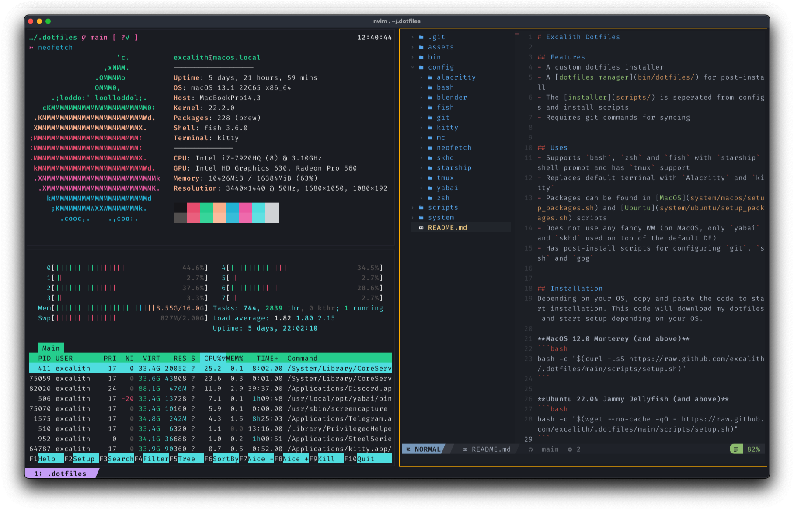

# Excalith Dotfiles



## Features

- A custom dotfiles installer
- A [dotfiles manager](bin/dotfiles/) for post-install
- The [installer](scripts/) is seperated from configs and install scripts
- Has post-install scripts for configuring `git`, `ssh` and `gpg`
- Requires git commands for syncing

## Uses

- Supports `bash`, `zsh` and `fish` with `starship` shell prompt and has `tmux` support
- Replaces default terminal with `Alacritty` and `kitty`
- Packages can be found in [MacOS](system/macos/setup_packages.sh) and [Ubuntu](system/ubuntu/setup_packages.sh) scripts
- Does not use any fancy WM (on MacOS, only `yabai` and `skhd` used on top of the default DE)

## Installation

Depending on your OS, copy and paste the code to start installation. This code will download my dotfiles and start setup depending on your OS.

### MacOS 12.0 Monterey (and above)

```bash
bash -c "$(curl -LsS https://raw.github.com/excalith/.dotfiles/main/scripts/setup.sh)"
```

## Ubuntu 22.04 Jammy Jellyfish (and above)

```bash
bash -c "$(wget --no-cache -qO - https://raw.github.com/excalith/.dotfiles/main/scripts/setup.sh)"
```

## Cloning

If you want to create your own dotfiles from this repository, you should

- Fork or clone this repository
- Update [setup](scripts/setup.sh) script with your repository settings (do not change the preset `.dotfiles` path)
- Change the configs and packages as you wish
- Push your configs to **your own** repository
- Run setup bash commands

## Maintenance

You can use `dotfiles` command for a primitive (WIP) dotfile manager script for running maintenance commands

## Credits

This dotfiles repository is a heavily ~~knocked-off~~ inspired version of beautiful [Cătălin’s dotfiles](https://github.com/alrra/dotfiles). You should probably check it out!

I have modified this dotfiles with my own taste of config files and added a bunch of helpers and utilities to install packages, extensions etc. from different sources that I trust. I tried to seperate installation system and OS-spesific configurations as much as I can, so it would be easier to implement new OS setups which I might do later.

## License

The code is available under the [MIT license](license).
